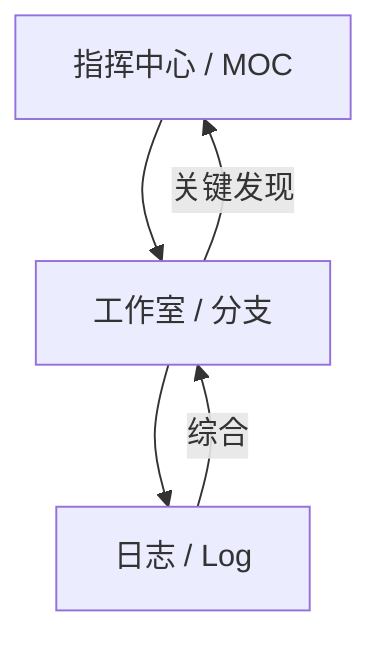

---
type:
  - branch-note
status: active
parent_project: ""
created: "2025.07.01"
---
# 🎯 Branch Objective / Core Question
> 

# ✅ Action Plan / Open Issues
*由下方的Log动态生成，不断演变的问题树和行动清单。*
*使用 `[ ]` 待办, `[x]` 完成, `[-]` 作废。*

- [ ] 

# 成果与结论 (Findings & Synthesis)
正文分为两种类型
类型一：直觉驱动型
- “已回答的关键问题”格式：列出## 核心原则和## 核心问题&解答
	- 缺点：像一个不连贯的常见问题解答，而不是一个有凝聚力的、独特的视角。需要更强大、“以综合为导向”的部分。
- 心智模型与框架：你超越了回答问题，开始**构建自己的概念工具**。你将研究综合成一个独特的框架、图表或心智模型来解释主题。这是最高形式的理解。
- 核心张力与权衡：发现的矛盾之处，以及如何平衡他们的。复杂的主题很少有简单的答案，需要驾驭相互竞争的思想。这展示了一种复杂、非二元的理解。
- 意外的洞察与“顿悟”时刻：捕捉你所做的非显而易见的、反直觉的或令人惊讶的发现。这些往往是任何研究项目中最有价值的收获。
- 开放性问题与未来方向：承认你的理解尚未完成。对主题的边界和你的自身进行了一种谦逊而诚实的评估。它为未来的研究项目提供了肥沃的土壤。

类型二：学术论文型
- 摘要 (Abstract)：在这里写一段高度凝练的全文摘要。
- 引言 (Introduction)：阐述你的研究问题、背景和重要性。
- 主体部分——理论框架：在这里，你将"B. 核心理论A的分析"笔记上方的“成果与结论”部分，用更流畅的语言重新组织和撰写。你可能会写：“根据对理论A的深入分析，我们可以得出其核心假设是……。”
- 主体部分——案例分析：这里综合了"B. 案例研究B"的精华内容。
- 结论 (Conclusion)：总结你的发现，并指出未来可能的研究方向。

们的大脑不是录音机；它们是模式匹配机器。当我们首先了解“大局”，然后是细节时，我们才能最好地理解事物。这被称为**自上而下处理**。强迫读者在细节中摸索以找到主要观点是“自下而上”的，这既耗费精力又效率低下。

最著名的框架是麦肯锡公司芭芭拉·明托（Barbara Minto）开发的**金字塔原则**。其核心规则很简单：**先给出答案。**


**1. “开门见山”（BLUF）或“电梯推销”（Elevator Pitch）**

  * **目的：** 这是你研究的最终提炼，放在笔记的最顶部，甚至在你主要的综合内容之前。它回答了读者隐含的问题：“我为什么要关心这个？最重要的收获是什么？”
  * **结构：** 应不超过1-3句话。如果你只有30秒来解释你的发现，这就是你会给出的答案。
  * **认知科学联系：** 这直接应用了金字塔原则。它立即给读者提供了主要的“模式”，因此所有后续信息都有一个可以放置的位置。它显著减少了焦虑和不确定性。
  * **示例（针对我们的项目）：**
```markdown
# 如何构建一个出色的项目笔记系统

> **核心要点：** 最有效的项目笔记系统不是一个僵硬的待办事项列表，而是一个“活生生”的生态系统，它将清晰的“综合”与凌乱的“日志”分开，从而实现动态规划和深入的、情境化的反思。

---

## 核心原则...
```

**2. 可视化框架或核心比喻**

  * **目的：** 我们的大脑绝大多数是视觉化的。一个简单的图表或一个强大的比喻可以比文字段落更有效地传达复杂的系统或思想。
  * **结构：** 这可以是一个简单的Mermaid图表，一个来自Excalidraw等工具的嵌入图像，或者只是一个你反复提及的清晰阐述的核心比喻。
  * **认知科学联系：** 这利用了**图片优越效应**。我们记住图片比记住文字更好。一个视觉锚点为读者提供了一个心理模型，以便在阅读过程中保持。
  * **示例（针对我们的项目）：**
```markdown
## “生命系统”框架

我将这个系统可视化为三个相互流入的部分：

* **指挥中心（MOC）：** 高层策略。
* **工作室（分支）：** 详细执行和思考。
* **日志（Logs）：** 旅程不可变的“事实真相”。
```

```
**3. “那又怎样？”/ 意义与应用**

  * **目的：** 本节明确回答了“既然我知道了这些，我应该如何做才能有所不同？”这个问题。它弥合了抽象知识和实际行动之间的差距。它展示了你研究的*实用性*。
  * **结构：** 一个包含可操作的收获或观点变化的要点列表。
  * **认知科学联系：** 这迎合了我们大脑对相关性和目的的渴望。没有应用的知识很快就会被遗忘。本节通过将其与潜在行动联系起来，使你的知识“粘性”。
  * **示例（针对我们的项目）：**
    ```markdown
    ## 那又怎样？（对我的工作流程的影响）

    - 我应该停止在研究项目开始时就尝试规划一切，而是专注于定义下一个即时、问题驱动的行动。
    - 我需要将我的笔记视为一个个人“思考环境”，而不是最终的“出版物”。
    - 将任务标记为 `[-] 已放弃` 应该被视为一个学习时刻，而不是失败。
```


当你在撰写综合部分时，请对照这个心理清单来检查你的文本，以确保它易于理解：
  * [ ] 五岁儿童测试： 我能向一个聪明的五岁孩子解释这个核心思想吗？（费曼普及的简化练习）。如果不能，我可能使用了太多行话。
  * [ ] 每句话一个想法： 每句话都只专注于一个清晰的观点吗？冗长、复杂的包含多个从句的句子会增加认知负荷。
  * [ ] 具体优于抽象： 我是否使用具体的例子来说明抽象的原则？`我们的大脑会忘记事情` 很好。`蔡格尼克效应，即我们的大脑会痴迷于未完成的任务，解释了为什么我没有记录的那个“bug修复”一直让我分心` 更好。
  * [ ] 使用路标： 我是否使用清晰的标题、副标题和过渡词（“然而”、“因此”、“总而言之”）来引导读者理解我的论点？
  * [ ] 主动语态： 我的写作是主动语态（“我发现……”）而不是被动语态（“有人发现……”）吗？主动语态更直接、更具吸引力，也更容易理解。


# 🔗 相关资源 (Related Resources)
- # 🧘USER
我现在在看这个研究型的项目笔记，有一个地方需要纠正，我这个研究是做给我自己看的，我也一定要按照学术论文的写法产出吗？比如现在我们在做的这个项目笔记的项目，我就没写成一篇正经的学术论文。我现在都是直觉在direct，要我把摘要引言综述啥的都补上好像有点难为我。还是说我的这个观念有问题？你说说你的看法呗
# 🧘USER
还是有两个问题
1. 阶段二：综合与收敛应该在阶段1探索足够深入之后再开始对吧？
2. 我感觉核心问题解答这个形式固然可以，但没法体现出我的整合效果啊。核心原则虽然有点难提炼但也还可以借鉴到其他的项目。还有，除了这两个section以外，还有什么section是可以借鉴通用的？
# 🧘USER
这时候我们需要深度广度思考一下，综合的时候还有那些板块需要写？还有可以结合人的认知科学，如何让人一下就能看懂我的思想核心是什么，不要搞七搞八，弄一堆让人看不懂的话。这样能让人很轻松地就能读完。


---

# Chronological Log
*记录所有阅读笔记、问题、灵感和认知调整。*

### 2025.07.01
- 